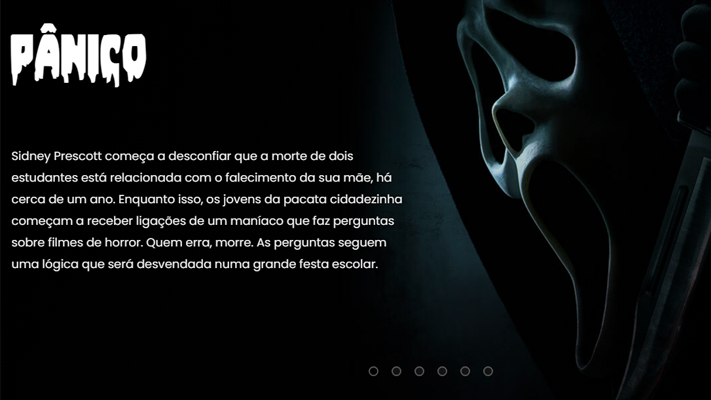

# Casa do Terror

> Um projeto onde estariam unidos os clássicos do terror juntamente como seu resumo para conhecê-los melhor. Feito de maneira simples e prática.

<h1><a href="https://barcellos-estudio.github.io/projeto-casa-do-terror/" target= _blank>Confira o site aqui</a></h1>

### Ajustes e melhorias ⚙️

O projeto ainda está em fase final de desenvolvimento e as próximas atualizações serão voltadas para as seguintes tarefas:

- [ ] Responsividade mobilie

[]

### Tecnologias utilizadas 💻

- HTML
- CSS
- JS
